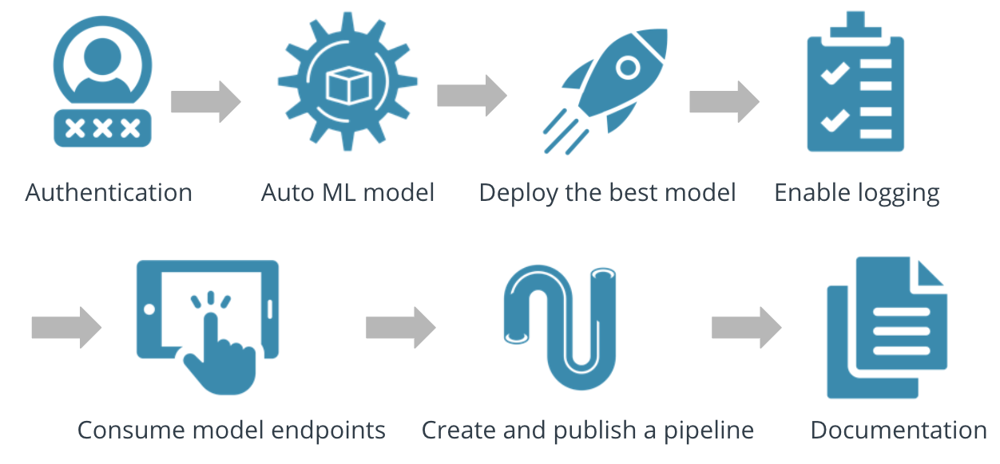

In this repository, we perform the following in Azure : 
- Authentication
- Automated ML Experiment
- Deploy the best model
- Enable logging
- Swagger Documentation
- Consume model endpoints
- Create and publish a pipeline
- Documentation

## Overview

## Dataset

## AutoML Experiment

## Deployment

## Swagger

## Endpoint

## Diagram

## Future Improvement

## Screencast link