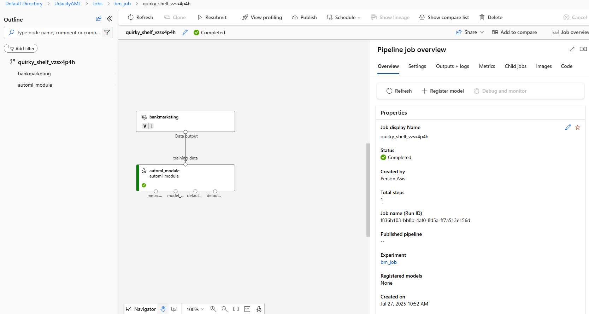

In this repository, we perform the following in Azure : 
- Authentication
- Automated ML Experiment
- Deploy the best model
- Enable logging
- Swagger Documentation
- Consume model endpoints
- Create and publish a pipeline
- Documentation

## Overview

This project demonstrates a complete MLOps workflow using Azure Machine Learning. It covers the process of authenticating with Azure, running automated machine learning experiments, deploying the best-performing model, enabling logging for monitoring, and exposing the model via REST endpoints with Swagger documentation. The repository also includes steps to consume the deployed endpoints and automate the workflow using Azure ML pipelines.

## Dataset

The dataset used in this project is uploaded to Azure ML and is visualized below. It contains features relevant to the machine learning task, such as input variables and target labels.

## AutoML Experiment

We leverage Azure AutoML to automatically train and tune multiple models on the dataset. The experiment identifies the best model based on evaluation metrics such as accuracy or RMSE.

## Deployment

The best model from the AutoML experiment is deployed as a web service on Azure. Deployment includes setting up the necessary compute resources and configuring the endpoint for inference.

## Swagger

Swagger documentation is automatically generated for the deployed endpoint, making it easy to understand and test the API interface.

## Endpoint and Pipeline

The deployed model endpoint can be consumed by external applications for real-time predictions. Example requests and responses are shown below. Completed and published Pipeline experiment is shown as well.

## Future Improvement

- Integrate CI/CD for automated deployment
- Add model monitoring and drift detection
- Support for multiple datasets and tasks
- Enhance security and access control
- Expand documentation with troubleshooting guides

## Screencast link

https://drive.google.com/file/d/1XesoaCIJc46a9PC8g1C9Z-Q22Q-9prwK/view?usp=sharing